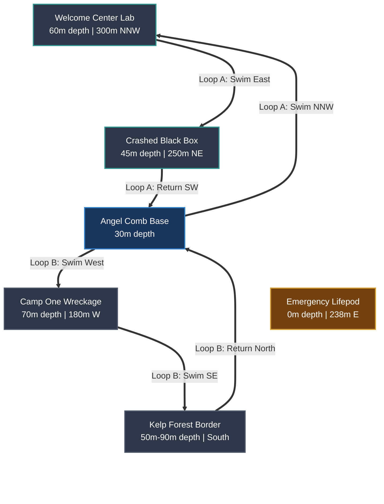

# Subnautica 2 Progression Roadmap & Exploration Tracker

[Sitemap](SITEMAP.md) | [Guide](GUIDE.md) | [Roadmap](TODO.md) | [Changelog](CHANGELOG.md)

A structured coaching roadmap and systematic exploration checklist for **Subnautica 2** (Early Access Standalone / Unreal Engine 5).

> [!NOTE]
> **Primary Progression Manual**: For clinical biome geometry matrices, high-level progression phases, beginner survival wisdom, transition criteria, and official dev news links, consult [GUIDE.md](./GUIDE.md).
> **Live Diagnostic Telemetry**: For dynamic progression state, active tool loadouts, inventory registers, and world streaming partition flags decoded from `savegame_1.sav`, consult [REPORT.md](./REPORT.md).

---

## 📋 Sequenced Action Roadmap (Next Session Focus)

> [!IMPORTANT]
> **Active Origin**: Starting at **Angel Comb Base** (`~30m depth`) with 6 Solar, 3 Hydro Turbines, Biolab, Processor, Scanner Station, Moonpool (with Tadpole Dock), Battery Charger, and Power Wall.

### 📍 Step 1: Scanner Room Calibration & Visor HUD Setup
* [ ] **Harvest Table Coral & Copper**:
  - Slice red/green shelf corals at base canyon walls with Survival Knife -> **Table Coral Samples** (`BP_TableCoral`). *Location: Look on the vertical rock walls of the Angel Comb canyon directly outside your base hatch (they grow in large red and green circular plates).*
  - Break limestone nodes -> **Copper Ore**. *Location: Plentiful on the shallow sandy ledges and seabed immediately surrounding your base and the origin Lifepod.*

* [ ] **Craft Scanner Room Upgrades** (at Scanner Room console):
  - [ ] **Range Upgrade** (`BP_ScannerRoomUpgrade_Range`) `[Need: 1x Copper Ore, 1x Magnetite]` — *Extends radar range*
  - [ ] **HUD Chip** `[Need: 1x Computer Chip (2x Table Coral, 1x Gold, 1x Copper Wire), 1x Magnetite]` — *Highlights resources directly on your visor (Fabricator)*
* [ ] **Target Outcrops**: Set Scanner Room to target **Galena Outcrops** (Lead) and **Table Coral**.

### 🏊‍♂️ Step 2: Basic Tools & Utility Blueprint Sweeps

To maximize your oxygen efficiency, tackle these blueprint unlocks in two geographic loops starting from **Angel Comb Base**:

#### 🟢 Loop A: Northern Loop (Tools & O₂ focus)
* [ ] **Welcome Center BioLab** `[~60m depth | 300m NNW of Base]`
  - *Target*: **Rebreather** blueprint `[Not Unlocked]`.
  - *Primary*: Follow the **Welcome Center** signal beacon. Search the interior lab data consoles and equipment lockers.
  - *Note*: Static data box unlock; only spawns inside the Welcome Center Lab.
* [ ] **Crashed Black Box Wreckage** `[~45m depth | 250m NE of Base]`
  - *Target*: **Laser Cutter** (`BP_LaserCutter`) — `[0/3 fragments | Need 3]`.
  - *Primary*: Follow the **Black Box** signal beacon. Scan the metal cargo crates scattered on the seabed around the wreckage.
  - *Backup*: If not fully unlocked, search the cargo crates near the **Thermal Vents** border `[~80m depth | 550m ENE of Base]`.

#### 🔵 Loop B: Southern Loop (Utility & Traversal focus)
> [!NOTE]
> *Save Telemetry Limitation*: Your save file only tracks your global fragment count (e.g., `2/3 Repair Tool`), not which specific physical fragments you scanned. If you search a primary wreckage site and find no fragments, it means you already scanned them during your early exploration, and you should proceed directly to the **Backup** locations listed below.

* [ ] **Camp One Wreckage** `[~70m depth | 180m W of Base]`
  - *Targets*:
    - [ ] **Repair Tool** (`BP_RepairTool`) — `[2/3 fragments | Need 1]`.
      - *Primary*: Scan inside the metal corridors/shelves at **Camp One** (follow signal beacon).
      - *Backup*: Search the nearby **Abandoned Basecamp** `[~70m depth | 180m W]` or crates outside **Welcome Center Lab** `[~60m depth | 300m NNW]`.
    - [ ] **Work Light** (`BP_WorkLight`) — `[1/2 fragments | Need 1]`.
      - *Primary*: Scan cargo crates immediately outside **Camp One**.
      - *Backup*: Search the **Abandoned Basecamp** `[~70m depth | 180m W]`.
    - [ ] **Wall Rack** (`BP_WallRack`) — `[1/3 fragments | Need 2]`.
      - *Primary*: Scan wall mounts inside **Camp One**.
      - *Backup*: Scan interior walls of the **Abandoned Basecamp** rooms.
  - *Action*: Follow the **Camp One** signal beacon. Once fully cleared, set its beacon to **Green / OFF** in your PDA.
* [ ] **Kelp Forest Border** `[~50m-90m depth | Directly South of Base]`
  - *Target*: **Seaglide** (`BP_Seaglide`) — `[0/3 fragments | Need 3]`.
  - *Primary*: Swim directly South/Southwest from **Angel Comb Base**. Look on the grassy seabed and around the roots of Creepvines.
  - *Backup*: Search the shallow cargo crates in the **Safe Shallows** `[0m-30m depth | East of Base]`.

### 🏗️ Step 3: Vehicle Construction & Refinement
* [ ] **Build Moonpool Vehicle Fabricator**: Install inside the Moonpool.
* [ ] **Build Tadpole Submersible** (`BP_Tadpole`): Assemble at the Moonpool Vehicle Fabricator.
* [ ] **Scan Vehicle Modification Station fragments**: Search wreck sites to construct the wall-mounted console.

### 🧭 Step 4: Deeper Exploration Transition
* [ ] **Search for Dive Elevator**: Sweep the **Thermal Vents** border `[80m-120m depth]` for the remaining **Dive Elevator** (`BP_DiveElevator`) fragment `[1/2 completed | Need 1]`.
  - **Navigation**: Swim `~450m Northeast/East` of the **Lifepod** (or `~550m East-Northeast` of **Angel Comb Base**) until you reach the volcanic trenches. Search around the edges of the active vents.

---

## 🧭 Exploration Verification SOP

Before turning OFF a HUD Beacon in your PDA Signals tab, verify:
1. **StoryGoal Complete**: Decoded save shows `DA__Signal_..._Hide` (terminal interacted).
2. **Blueprints Complete**: No fractional blueprints (e.g., `2/3`) remaining in PDA.
3. **Sealed Doors Cut**: All bulkheads cut open with **Laser Cutter** (`BP_LaserCutter`).

---

## 🗺️ Active Perimeter Destination Tracker

### 1. Crashed Black Box (Alterra Emergency Signal)
- **Location**: `~45m depth | ~380m North` (250m NE of base)
- **Status**: **IN PROGRESS**
  - [ ] Scan **Light Stick** / **Floodlight** & **Bar Table** / **Bench** blueprints.
  - [ ] Salvage surrounding Titanium cargo crates.

### 2. Thermal Vents & Hydrothermal Fissures (Volcanic Trenches)
- **Location**: `~80m-120m depth | ~450m NE/E` (550m ENE of base)
- **Status**: **SCOUTED / UNCLOSED**
  - [ ] Scan **Thermal Plant** & **Power Transmitter** fragments near vents.
  - [ ] Scan **Vehicle Modification Station** fragments.
  - [ ] Harvest **Magnetite** and **Lithium** surrounding fissures.

### 3. Tadpole Pens (New Narrative Outpost)
- **Location**: Unlocked via `DA_StoryGoal_Investigation_TadpolePensNoA`
- **Status**: **UNEXPLORED**
  - [ ] Explore outpost & scan technology fragments.
  - [ ] Locate the source of the story goal transmission.

---

## 🌋 Future Adaptation: Volcanic & Lava Environments (Phase 4 Preview)
Keep these high-temperature adaptations in mind as you prepare to transition to the abyssal trenches (>600m depth) later in your journey:
* [ ] **Reinforced Dive Suit**: Increases your heat tolerance up to 70°C and provides protection against volcanic debris and thermal damage.
* [ ] **Vehicle Thermal Reactor**: Converts ambient heat (>35°C) in volcanic trenches into electricity to automatically recharge your submersible's power cells.
* [ ] **Prawn Suit / Heavy Mech**: Essential for walking on the molten lava floor and mining large crystalline **Kyanite** and **Precursor Alloy** deposits.
* [ ] **Mk3 Depth Modules**: Reinforced titanium-alloy plating to upgrade your vehicle's crush depth to 1000m+.

---

## 📸 Visual Telemetry via Screenshots
* Capture in-game screenshots of your **PDA Blueprints tab** and **Base Storage Lockers**. Drop them directly in chat for AI visual verification of your progress!
